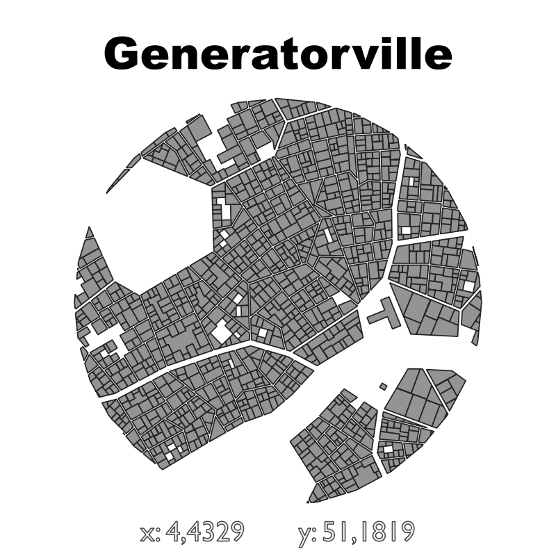

# Building Footprint Poster
Recently a lot of Articles about [making Building Footprint Posters](http://googlemapsmania.blogspot.com/2019/02/making-building-footprint-posters.html) and [Street Patterns Generators](http://maptime-ams.github.io/street-patterns/) showed up on the internet.  In QGIS it's easy to make those too with Geometry Generator. In the example the buildings are clipped to a circle that is created 500 meter around the center of the map. An extra copy of the layer is added to make a label with the X and Y coordinates of the center of the map.

<table><tr><td></td></tr></table> 

[Download the building QML file for this Geometry Generator Style](https://gitlab.com/GIS-projects/qgis-geometry-generator-examples/raw/master/QML-files/building_footprint_poster/building_footprint_poster.qml?inline=false)

[Download the label QML file for this Geometry Generator Style](https://gitlab.com/GIS-projects/qgis-geometry-generator-examples/raw/master/QML-files/building_footprint_poster/building_footprint_poster_label.qml?inline=false)