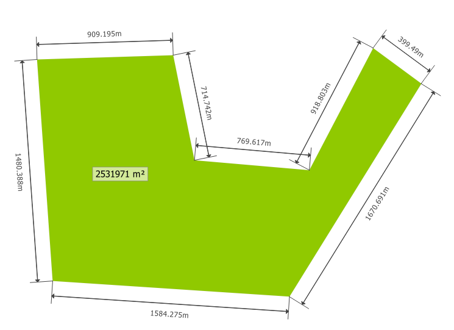
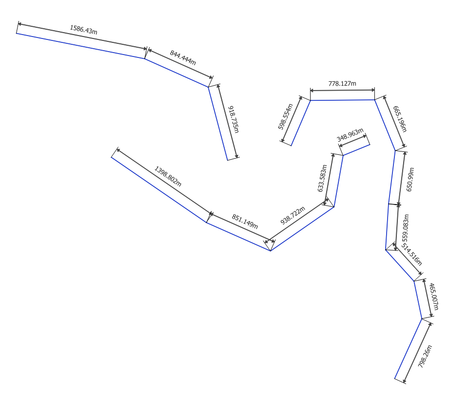

# Adding dimensions
Adding dimensions is very common in CAD programs, but in a GIS this usually isn't possible.  In QGIS you can add dimensions to polygons or lines using styles.  Of course this will give the best results if your layer doesn't contain too complex items.  Below you can find a styling for polygon layers and one for line layers. 

Because [a bug in QGIS](https://issues.qgis.org/issues/18384) was solved in QGIS 3.6, it's easier to create this style in QGIS 3.6 than in previous versions. Therefore per layer type two different versions of the QML-files are available to download.

## Dimensions for Polygons
<table><tr><td></td></tr></table> 

[Download the QML file for this Geometry Generator Style for QGIS 3.6 and newer versions](https://gitlab.com/GIS-projects/qgis-geometry-generator-examples/raw/master/QML-files/dimensions/dimensions_polygon-qgis3-6.qml?inline=false)

[Download the QML file for this Geometry Generator Style for QGIS 3.0, 3.2 & 3.4](https://gitlab.com/GIS-projects/qgis-geometry-generator-examples/raw/master/QML-files/dimensions/dimensions_polygon-qgis3-0_3-4.qml?inline=false)

## Dimensions for Lines
<table><tr><td></td></tr></table> 

[Download the QML file for this Geometry Generator Style for QGIS 3.6 and newer versions](https://gitlab.com/GIS-projects/qgis-geometry-generator-examples/raw/master/QML-files/dimensions/dimensions_line-qgis3-6.qml?inline=false)

[Download the QML file for this Geometry Generator Style for QGIS 3.0, 3.2 & 3.4](https://gitlab.com/GIS-projects/qgis-geometry-generator-examples/raw/master/QML-files/dimensions/dimensions_line-qgis3-0_3-4.qml?inline=false)