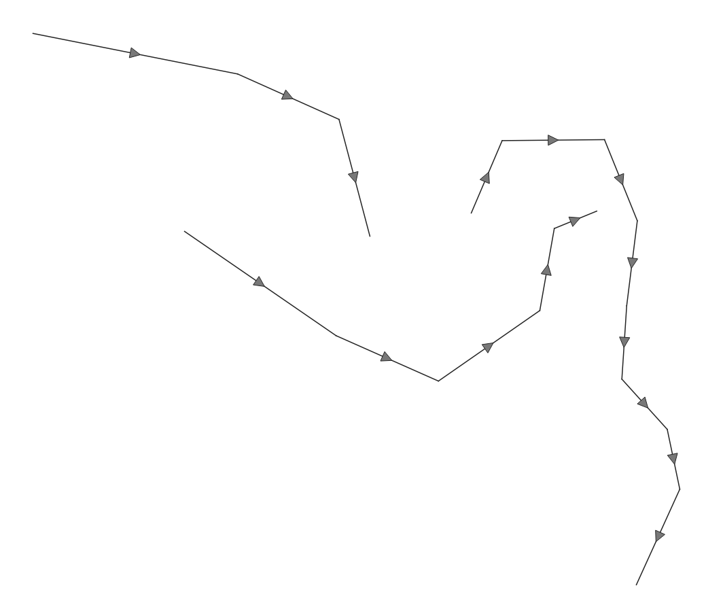

# Adding directions
If you use a Simple Line combined with a Marker Line in QGIS, it's pretty easy to add arrows showing the direction of your lines. But sometimes this method gives too many arrows as a result, so your map looks overcrowded.  With Geometry Generator  it is possible to add 1 arrow per line of your polylines.

Since QGIS 3.10 this is core functionality, and so this Geometry Generator is no longer needed to achieve this result.

<table><tr><td></td></tr></table> 

[Download the QML file for this Geometry Generator Style](https://gitlab.com/GIS-projects/qgis-geometry-generator-examples/raw/master/QML-files/direction/direction.qml?inline=false)
