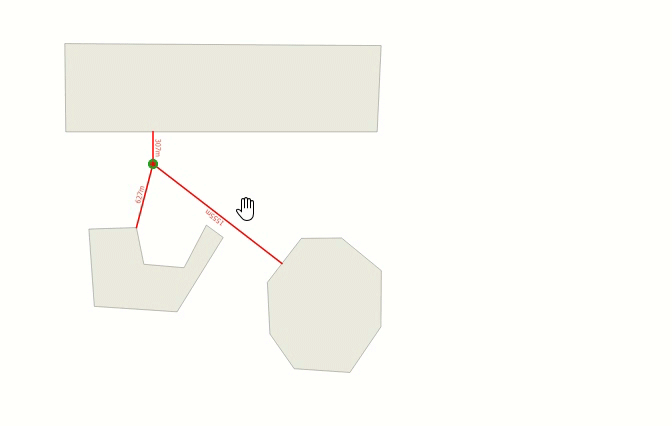

# Dynamic distance lines
These styles generate distance lines on your map everytime you interact with the map window. Interacting in this case can be for example select an object, use the pan tool or zoom in or out. Everytime you do these kind of actions distance lines will be shown between all items in the layer and the point on the map you interacted on.  

Of course these kind of styles will work best for layers that don't contain too many items.  Since the styles are based on the parameter @canvas_cursor_point, the generated lines are temporary and will never be saved. They aren't even exported with the "Export Map to Image" function.

<table><tr><td></td></tr></table> 

[Download the QML file for this Geometry Generator Style for polygons](https://gitlab.com/GIS-projects/qgis-geometry-generator-examples/raw/master/QML-files/dynamic_distance_lines/dynamic_distance_lines_for_polygons.qml?inline=false)

[Download the QML file for this Geometry Generator Style for lines](https://gitlab.com/GIS-projects/qgis-geometry-generator-examples/raw/master/QML-files/dynamic_distance_lines/dynamic_distance_lines_for_lines.qml?inline=false)

[Download the QML file for this Geometry Generator Style for points](https://gitlab.com/GIS-projects/qgis-geometry-generator-examples/raw/master/QML-files/dynamic_distance_lines/dynamic_distance_lines_for_points.qml?inline=false)
