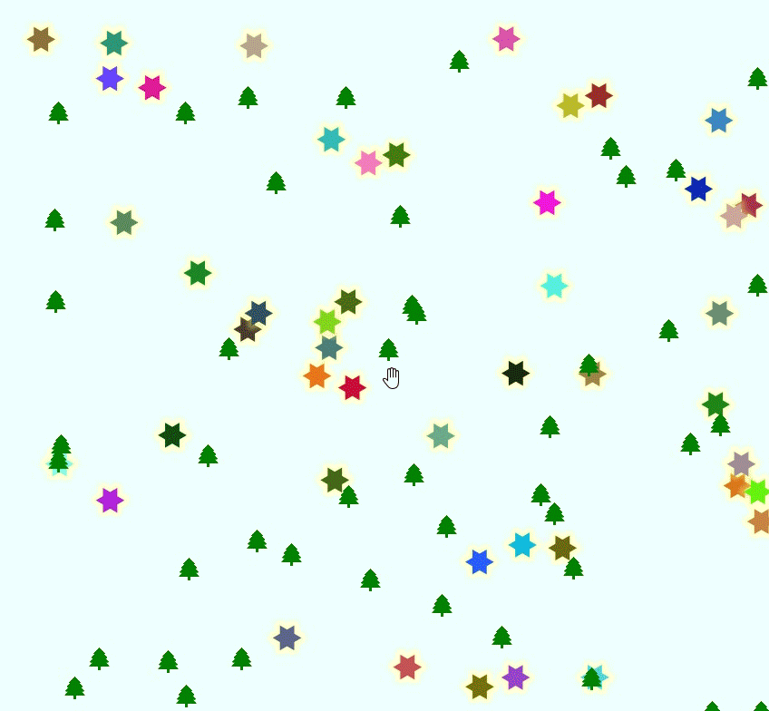

# Holiday Random
This style is holiday themed, but it's actually all about adding randomized styling to your layer.  The stars are located on the points of your layer, but they change color anytime you interact with the map (zoom, move, select,...). At the same time christmas trees are added to the map at random locations inside the bounding box of your points layer. Everytime you interact with the map the trees change location.  For each point in your layer, 3 trees are shown on the map.

<table><tr><td></td></tr></table> 

[Download the QML file for this Geometry Generator Style](https://gitlab.com/GIS-projects/qgis-geometry-generator-examples/raw/master/QML-files/holiday_random/holiday_random.qml?inline=false)
