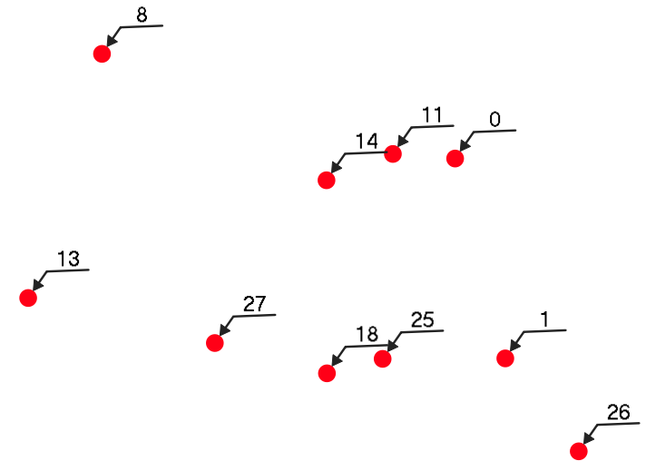

# Labels with a leader
Creating labels with a leader is very common in CAD programs, but in a GIS this isn't always possible.  In QGIS you can add these kind of lables using styles.  Of course this will give the best results if your layer doesn't contain too many items that are too close together. In the example below the field id is used to label the points.

<table><tr><td></td></tr></table> 

[Download the QML file for this Geometry Generator Style](https://gitlab.com/GIS-projects/qgis-geometry-generator-examples/raw/master/QML-files/label_with_leader/label_with_leader.qml?inline=false)
