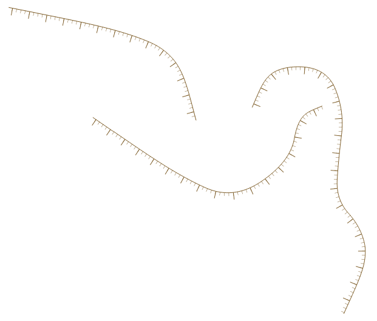

# Mixed orthogonal stripes at an edge
This style uses font marker lines to create the orthogonal stripes, but a Geometry Generator is used to smooth the original lines, so the stripes are oriented in a more beautiful way.

<table><tr><td></td></tr></table> 

[Download the QML file for this Geometry Generator Style](https://gitlab.com/GIS-projects/qgis-geometry-generator-examples/raw/master/QML-files/mixed_orthogonal_stripes_at_an_edge/mixed_orthogonal_stripes_at_an_edge.qml?inline=false)
