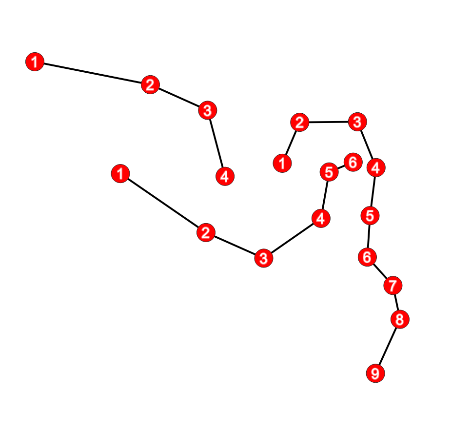

# Numbered nodes
If you have a polyline layer and you want to emphasize the nodes of your polylines, you can number them.

<table><tr><td></td></tr></table> 

[Download the QML file for this Geometry Generator Style](https://gitlab.com/GIS-projects/qgis-geometry-generator-examples/raw/master/QML-files/numbered_nodes/numbered_nodes.qml?inline=false)
