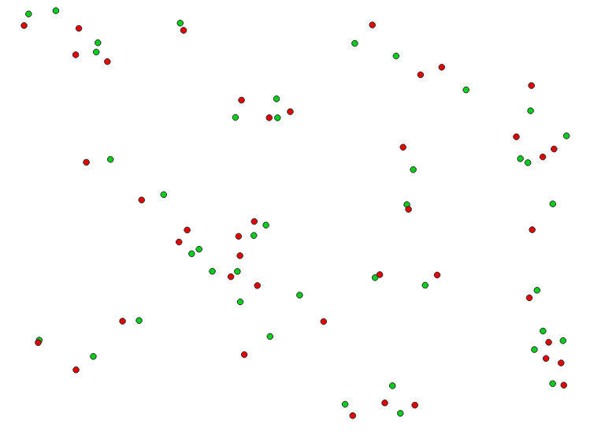

# Obscurify privacy sensitive data
Previously I wrote an article about how you can obscurify privacy sensitive data in PostGIS.  With this Geometry Generator style you can do the exact same thing in QGIS.  The why and how behind this technique can be read in [my PostGIS article on my blog](https://stuyts.xyz/2018/05/31/obscurify-privacy-sensitive-data-with-postgis/).

Inside the Geometry Generator I created a parameter *amount_of_obscurity*. If you change this parameter to a higher number, the points will be obscurified more.  If the points are too far away from the original location, you have to lower this number.

<table><tr><td></td></tr></table> 

[Download the QML file for this Geometry Generator Style](https://gitlab.com/GIS-projects/qgis-geometry-generator-examples/raw/master/QML-files/obscurify_privacy_sensitive_data/obscurify_privacy_sensitive_data.qml?inline=false)
