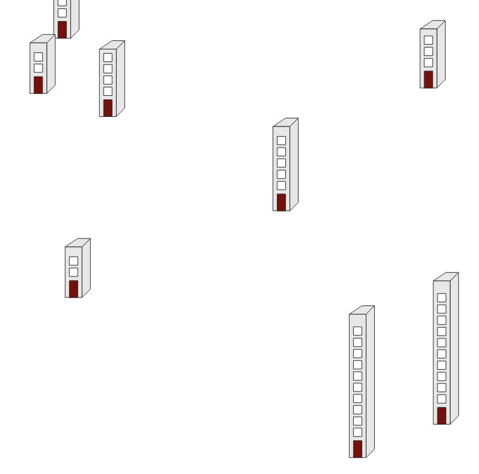

# Points as buildings
In QGIS you can create graphic representations of points that are sized based on the value in one of the fields using Geometry Generator Styles.  Of course this will give the best result if your layer doesn't contain too many items that are close together. In the example below the field *value* is used to size the buildings.

<table><tr><td></td></tr></table> 

[Download the QML file for this Geometry Generator Style](https://gitlab.com/GIS-projects/qgis-geometry-generator-examples/raw/master/QML-files/points_as_building/points_as_building.qml?inline=false)
