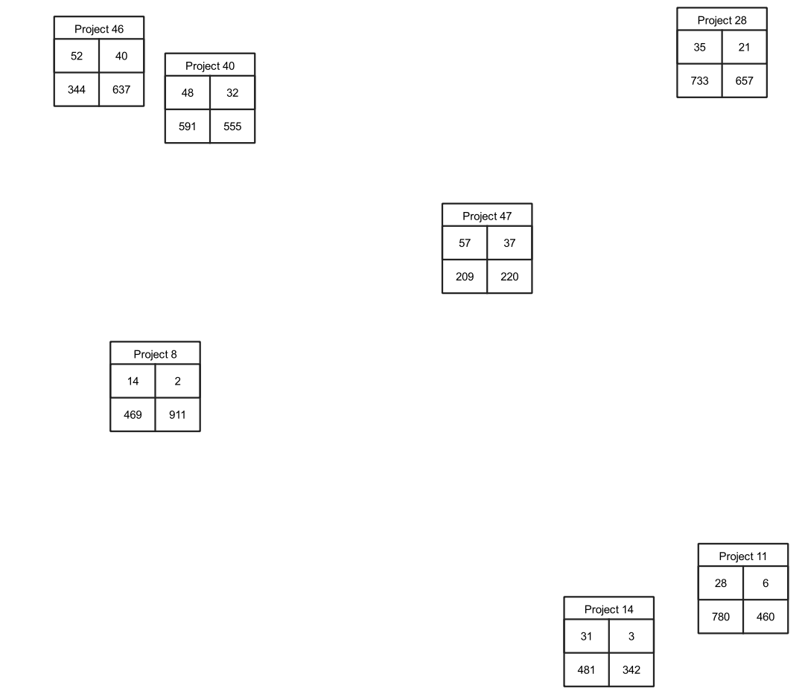

# Points as tables
If you want to create small tables on your map filled with values from the fields of a points table, you can use Geometry Generators to produce them.

<table><tr><td></td></tr></table> 

[Download the QML file for this Geometry Generator Style](https://gitlab.com/GIS-projects/qgis-geometry-generator-examples/raw/master/QML-files/points_as_tables/points_as_tables.qml?inline=false)
