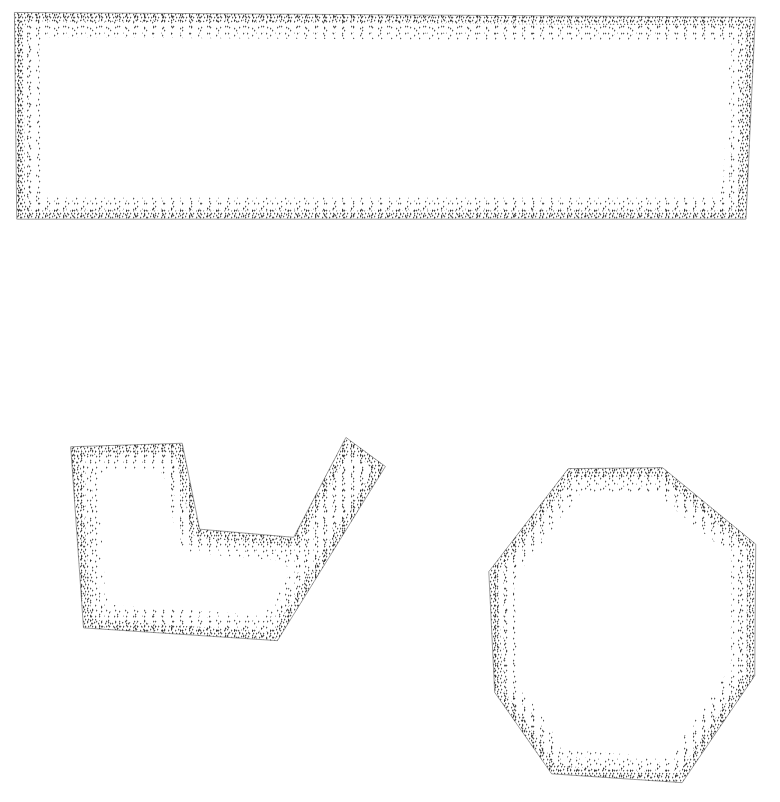

# Pseudo-random points
In QGIS you can add pseudo-random points to the inside of the edge of polygons using a combination of Geometry generators and Point pattern fills in styles.  

<table><tr><td></td></tr></table> 

[Download the QML file for this Geometry Generator Style](https://gitlab.com/GIS-projects/qgis-geometry-generator-examples/raw/master/QML-files/pseudo-random_points_edge/pseudo-random_points_edge.qml?inline=false)
