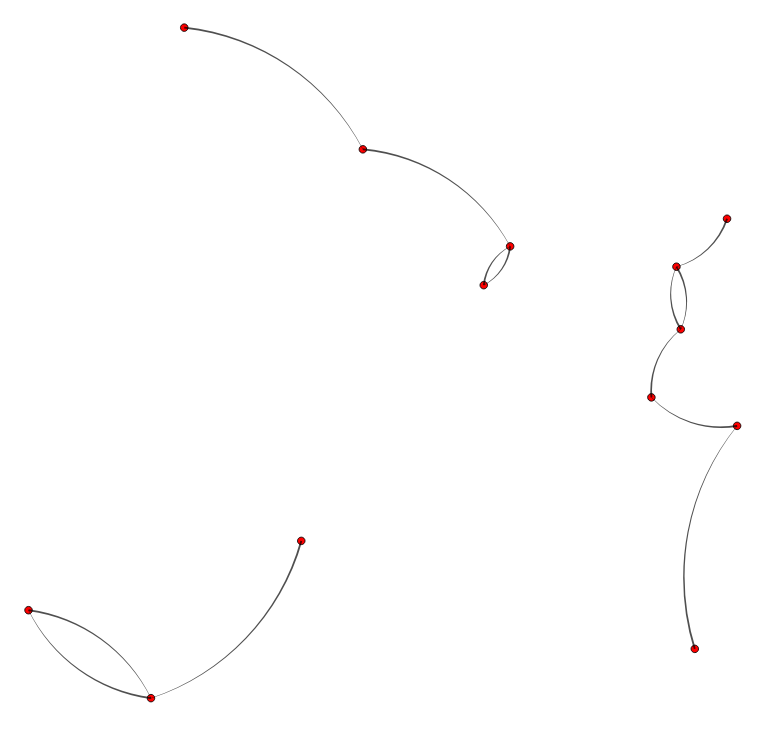

# Visiualize nearest neighbours
This QGIS style will draw a curved line between a point and the closest other point in that same layer. This way you can visualize nearest neighbours and also see clusters of points.

<table><tr><td></td></tr></table> 

[Download the QML file for this Geometry Generator Style](https://gitlab.com/GIS-projects/qgis-geometry-generator-examples/raw/master/QML-files/visiualize_nearest_neighbours/visiualize_nearest_neighbours.qml?inline=false)
